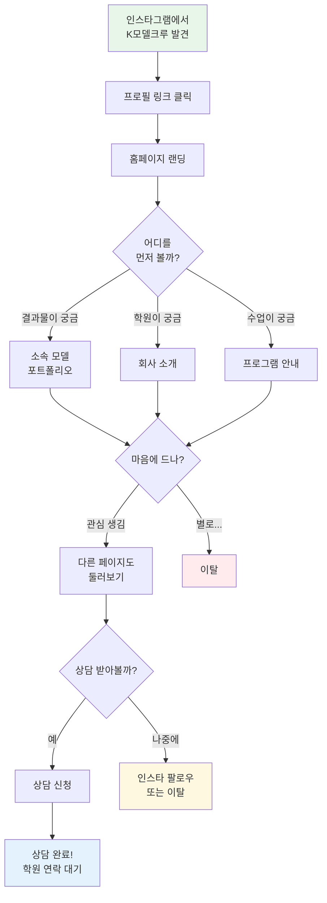
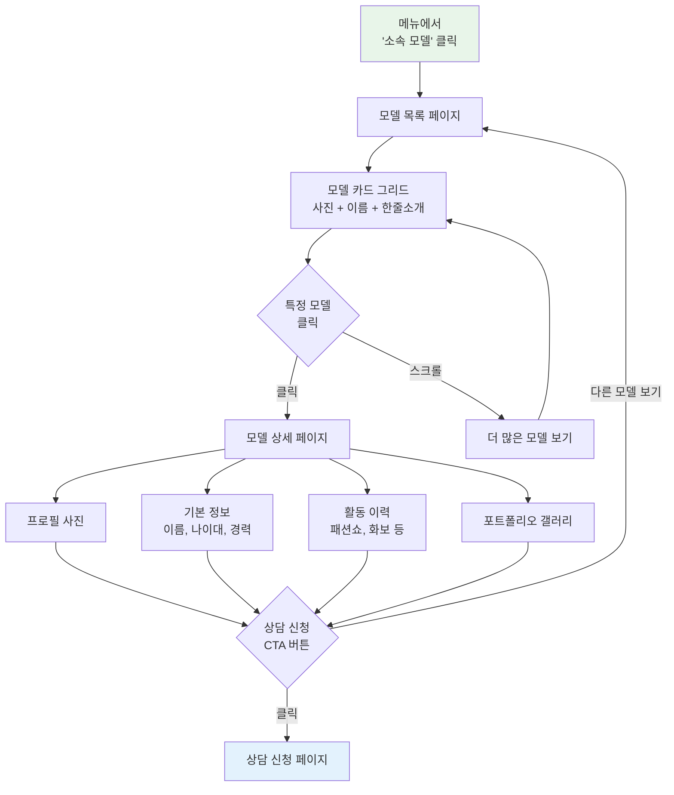
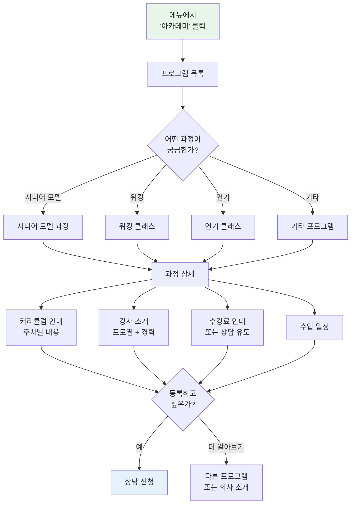
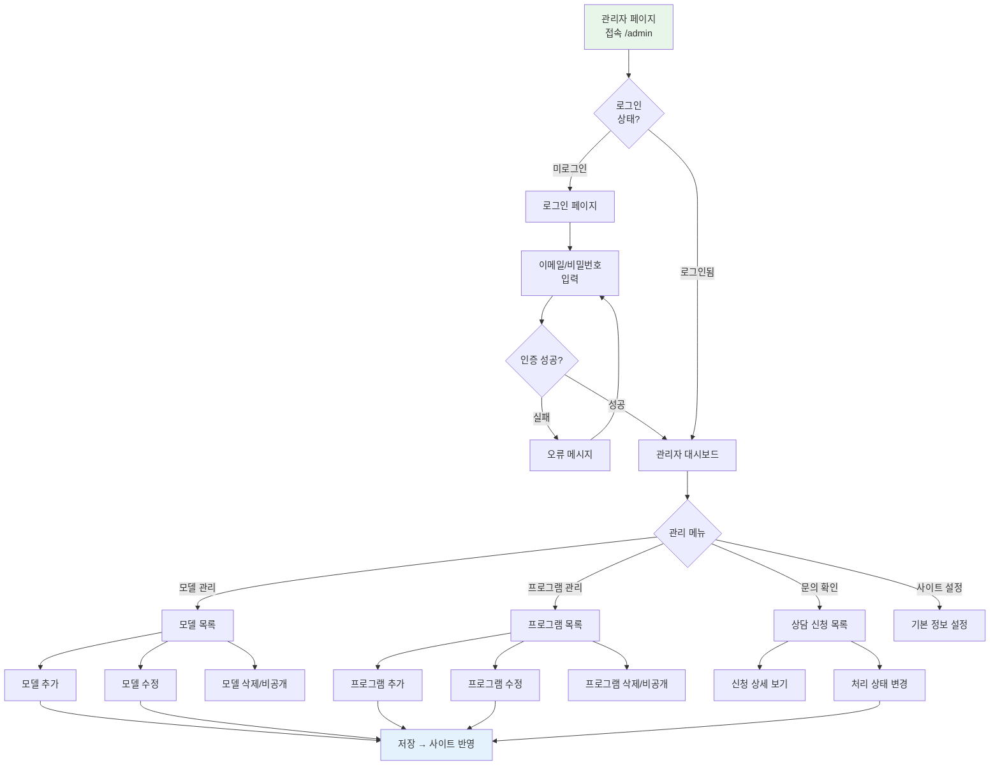
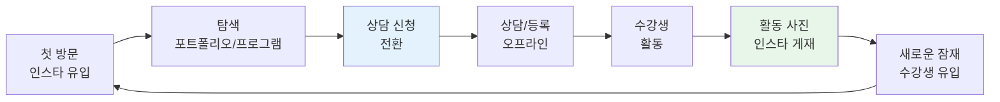

# User Flow (사용자 흐름도)
## K모델크루 아카데미 홈페이지

**문서 버전:** v1.0  
**작성일:** 2026년 1월 7일  
**프로젝트 식별자:** KMODEL-2026  
**관련 문서:** PRD v1.0

---

## 1. 전체 사용자 여정 개요

### 1.1 주요 사용자 흐름

| 흐름 ID | 흐름명 | 시작점 | 목표 | 관련 기능 |
|---------|--------|--------|------|-----------|
| UF-1 | 첫 방문 탐색 | 인스타그램 유입 | 학원 이해 | 전체 |
| UF-2 | 소속 모델 열람 | 홈/메뉴 | 결과물 확인 | FEAT-3 |
| UF-3 | 프로그램 확인 | 홈/메뉴 | 커리큘럼/수강료 파악 | FEAT-2 |
| UF-4 | 상담 신청 | 어느 페이지든 | 상담 예약 완료 | FEAT-4 |
| UF-5 | 관리자 콘텐츠 관리 | 관리자 로그인 | 콘텐츠 업데이트 | Admin |

---

## 2. UF-1: 첫 방문 탐색 흐름

### 2.1 흐름도



### 2.2 핵심 전환 포인트

| 단계 | 목표 | 성공 기준 | 실패 시 대응 |
|------|------|-----------|--------------|
| 랜딩 → 탐색 | 첫인상으로 관심 유발 | 다른 페이지로 이동 | 히어로 섹션 개선 |
| 탐색 → 관심 | 콘텐츠로 신뢰 구축 | 2페이지 이상 조회 | 콘텐츠 품질 개선 |
| 관심 → 상담 | 행동 유도 | 상담 신청 클릭 | CTA 위치/문구 개선 |

---

## 3. UF-2: 소속 모델 열람 흐름 (FEAT-3)

### 3.1 흐름도



### 3.2 페이지별 요소

**모델 목록 페이지:**
- 헤더: "소속 모델" 타이틀 + 서브 카피
- 필터 (선택): 전체 / 시니어 / 영 모델
- 모델 카드 그리드 (반응형: 모바일 2열, PC 3~4열)
- 각 카드: 대표 사진 + 이름 + 한줄 소개
- 하단 CTA: "나도 K모델크루와 함께하고 싶다면"

**모델 상세 페이지:**
- 프로필 영역: 대표 사진 + 기본 정보
- 활동 이력 타임라인 또는 리스트
- 포트폴리오 갤러리 (라이트박스)
- 고정 CTA 버튼: "상담 신청하기"

---

## 4. UF-3: 프로그램 확인 흐름 (FEAT-2)

### 4.1 흐름도



### 4.2 페이지별 요소

**프로그램 목록 페이지:**
- 헤더: "아카데미 프로그램" + 교육 철학 서브 카피
- 프로그램 카드: 대표 이미지 + 과정명 + 간단 설명 + 기간/수강료 요약
- 강사진 미리보기 섹션
- 하단 CTA: "맞춤 상담 받아보기"

**프로그램 상세 페이지:**
- 과정 개요: 이름, 대상, 기간, 정원
- 커리큘럼: 주차별 또는 회차별 내용
- 담당 강사: 프로필 카드
- 수강료: 명시 또는 "상담 문의"
- 수업 일정: 요일, 시간
- CTA: "이 과정 상담 신청하기"

---

## 5. UF-4: 상담 신청 흐름 (FEAT-4)

### 5.1 흐름도

```mermaid
graph TD
    A[상담 신청<br/>버튼 클릭] --> B[상담 신청 폼]
    
    B --> C[필수 정보 입력]
    C --> C1[이름]
    C --> C2[연락처]
    C --> C3[관심 프로그램<br/>선택]
    C --> C4[문의 내용<br/>선택사항]
    
    C1 --> D[개인정보<br/>수집 동의 체크]
    C2 --> D
    C3 --> D
    C4 --> D
    
    D --> E{유효성<br/>검사}
    
    E -->|"실패"| F[오류 메시지<br/>해당 필드 표시]
    F --> C
    
    E -->|"성공"| G[제출 버튼<br/>활성화]
    
    G --> H[제출]
    
    H --> I{서버 처리}
    
    I -->|"성공"| J[완료 화면<br/>"상담 신청이<br/>완료되었습니다"]
    I -->|"실패"| K[오류 안내<br/>재시도 유도]
    
    J --> L[학원 측<br/>알림톡 수신]
    J --> M[홈으로 이동<br/>또는 다른 탐색]
    
    K --> H
    
    style A fill:#E8F5E9
    style J fill:#E3F2FD
    style K fill:#FFEBEE
```

### 5.2 폼 필드 상세

| 필드 | 타입 | 필수 | 유효성 검사 |
|------|------|------|-------------|
| 이름 | 텍스트 | ✓ | 2~20자, 한글/영문 |
| 연락처 | 전화번호 | ✓ | 010-XXXX-XXXX 형식 |
| 관심 프로그램 | 선택(드롭다운) | ✓ | 목록 중 선택 |
| 문의 내용 | 텍스트영역 | - | 최대 500자 |
| 개인정보 동의 | 체크박스 | ✓ | 체크 필수 |

### 5.3 알림 발송 흐름

```
상담 신청 제출
    │
    ├─→ DB 저장 (Supabase inquiries 테이블)
    │
    └─→ Netlify Function 트리거
            │
            └─→ 알림톡 API 호출
                    │
                    └─→ 학원 담당자 휴대폰으로 알림
                         "새로운 상담 신청이 접수되었습니다.
                          이름: 홍길동
                          연락처: 010-1234-5678
                          관심 프로그램: 시니어 모델 과정"
```

---

## 6. UF-5: 관리자 콘텐츠 관리 흐름

### 6.1 흐름도



### 6.2 관리자 기능 상세

**모델 관리:**
| 기능 | 입력 필드 | 비고 |
|------|-----------|------|
| 추가/수정 | 이름, 나이대, 한줄소개, 프로필사진, 활동이력, 포트폴리오 이미지들, 공개여부, 정렬순서 | 드래그앤드롭 이미지 업로드 |
| 삭제 | - | 소프트 삭제 (비공개 전환) |

**프로그램 관리:**
| 기능 | 입력 필드 | 비고 |
|------|-----------|------|
| 추가/수정 | 과정명, 대상, 기간, 커리큘럼(위지윅), 강사, 수강료, 일정, 대표이미지, 공개여부 | 마크다운 또는 위지윅 에디터 |
| 삭제 | - | 소프트 삭제 |

**상담 신청 관리:**
| 기능 | 동작 | 비고 |
|------|------|------|
| 목록 보기 | 최신순 정렬, 상태 필터 | 신규/처리중/완료 |
| 상세 보기 | 모든 입력 정보 확인 | - |
| 상태 변경 | 신규 → 처리중 → 완료 | 드롭다운 선택 |

---

## 7. 글로벌 네비게이션 구조

### 7.1 GNB (메인 메뉴)

```
┌─────────────────────────────────────────────────────────┐
│  [로고]                                    [상담신청]   │
│                                                         │
│  회사소개  |  아카데미  |  소속모델  |  오시는길         │
└─────────────────────────────────────────────────────────┘
```

**모바일 (햄버거 메뉴):**
```
┌─────────────────────┐
│  [로고]    [≡]      │
└─────────────────────┘
        │
        ▼ (열림)
┌─────────────────────┐
│  회사소개           │
│  아카데미           │
│  소속모델           │
│  오시는길           │
│  ─────────────      │
│  [상담 신청하기]    │
└─────────────────────┘
```

### 7.2 푸터

```
┌─────────────────────────────────────────────────────────┐
│  K모델크루 아카데미                                      │
│                                                         │
│  주소: 서울시 ...                                       │
│  전화: 02-XXXX-XXXX                                     │
│  이메일: contact@kmodelcrew.com                         │
│                                                         │
│  [인스타그램 아이콘]                                     │
│                                                         │
│  © 2026 K모델크루 아카데미. All rights reserved.        │
│  개인정보처리방침                                        │
└─────────────────────────────────────────────────────────┘
```

---

## 8. 온보딩 → 핵심작업 → 리텐션 루프

### 8.1 Sticky Loop 설계



### 8.2 리텐션 포인트

| 포인트 | 전략 |
|--------|------|
| 첫 방문 → 재방문 | 인스타 피드 연동으로 "새 소식"이 있음을 암시 |
| 상담 후 → 등록 전 | 학원 연락으로 오프라인 전환 |
| 수강생 → 홍보대사 | 활동 사진을 홈페이지/인스타에 게재하여 선순환 |

---

*이 문서는 PRD의 사용자 스토리를 시각적 흐름으로 구체화한 것입니다. 각 흐름의 FEAT-ID는 PRD와 연결됩니다.*
