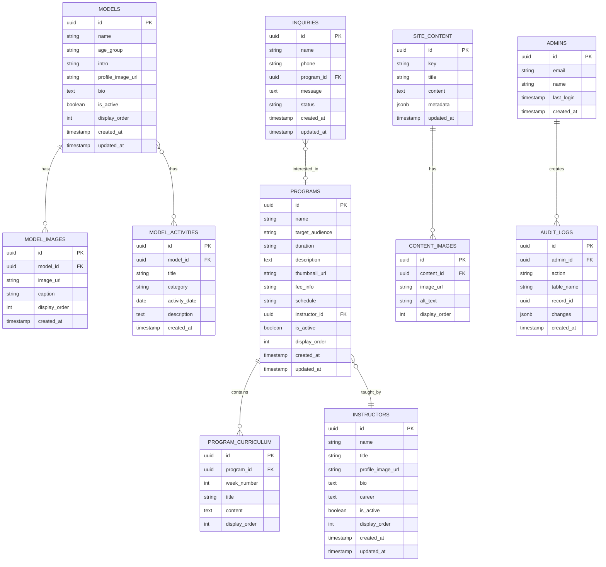

# Database Design (데이터베이스 설계)
## K모델크루 아카데미 홈페이지

**문서 버전:** v1.0  
**작성일:** 2026년 1월 7일  
**프로젝트 식별자:** KMODEL-2026  
**관련 문서:** PRD v1.0, TRD v1.0

---

## 1. 데이터베이스 개요

### 1.1 설계 원칙

| 원칙 | 설명 |
|------|------|
| **단순성 우선** | 1인 운영에 적합한 최소 테이블 구조 |
| **확장 가능성** | 향후 스토어 기능 추가를 고려한 설계 |
| **정규화** | 3NF 수준 유지, 불필요한 중복 제거 |
| **소프트 삭제** | 실수로 인한 데이터 손실 방지 |

### 1.2 데이터베이스 시스템

- **DBMS:** PostgreSQL 15 (Supabase 제공)
- **파일 저장:** Supabase Storage
- **인증:** Supabase Auth

---

## 2. ERD (Entity Relationship Diagram)

### 2.1 전체 ERD



---

## 3. 테이블 상세 정의

### 3.1 models (소속 모델) - FEAT-3

> 소속 모델의 기본 정보를 저장합니다.

| 컬럼명 | 타입 | 제약조건 | 설명 |
|--------|------|----------|------|
| `id` | UUID | PK, DEFAULT uuid_generate_v4() | 고유 식별자 |
| `name` | VARCHAR(100) | NOT NULL | 모델 이름 |
| `age_group` | VARCHAR(20) | NOT NULL | 나이대 (예: "50대", "60대") |
| `intro` | VARCHAR(200) | | 한줄 소개 |
| `profile_image_url` | TEXT | NOT NULL | 대표 사진 URL |
| `bio` | TEXT | | 상세 소개 |
| `is_active` | BOOLEAN | DEFAULT true | 공개 여부 |
| `display_order` | INTEGER | DEFAULT 0 | 정렬 순서 (낮을수록 먼저) |
| `created_at` | TIMESTAMPTZ | DEFAULT now() | 생성일시 |
| `updated_at` | TIMESTAMPTZ | DEFAULT now() | 수정일시 |

**인덱스:**
- `idx_models_active_order`: (`is_active`, `display_order`) - 활성 모델 정렬 조회

---

### 3.2 model_images (모델 포트폴리오 이미지)

> 각 모델의 포트폴리오 갤러리 이미지를 저장합니다.

| 컬럼명 | 타입 | 제약조건 | 설명 |
|--------|------|----------|------|
| `id` | UUID | PK | 고유 식별자 |
| `model_id` | UUID | FK → models.id, ON DELETE CASCADE | 소속 모델 |
| `image_url` | TEXT | NOT NULL | 이미지 URL |
| `caption` | VARCHAR(200) | | 이미지 설명 |
| `display_order` | INTEGER | DEFAULT 0 | 정렬 순서 |
| `created_at` | TIMESTAMPTZ | DEFAULT now() | 생성일시 |

**인덱스:**
- `idx_model_images_model`: (`model_id`, `display_order`)

---

### 3.3 model_activities (모델 활동 이력)

> 모델의 활동 이력 (패션쇼, 화보, 방송 등)을 저장합니다.

| 컬럼명 | 타입 | 제약조건 | 설명 |
|--------|------|----------|------|
| `id` | UUID | PK | 고유 식별자 |
| `model_id` | UUID | FK → models.id, ON DELETE CASCADE | 소속 모델 |
| `title` | VARCHAR(200) | NOT NULL | 활동명 |
| `category` | VARCHAR(50) | NOT NULL | 카테고리 (fashion_show, photoshoot, broadcast, etc.) |
| `activity_date` | DATE | | 활동 날짜 |
| `description` | TEXT | | 상세 설명 |
| `created_at` | TIMESTAMPTZ | DEFAULT now() | 생성일시 |

**카테고리 ENUM 값:**
- `fashion_show`: 패션쇼
- `photoshoot`: 화보/촬영
- `broadcast`: 방송
- `advertisement`: 광고
- `other`: 기타

---

### 3.4 programs (아카데미 프로그램) - FEAT-2

> 아카데미에서 운영하는 교육 프로그램 정보를 저장합니다.

| 컬럼명 | 타입 | 제약조건 | 설명 |
|--------|------|----------|------|
| `id` | UUID | PK | 고유 식별자 |
| `name` | VARCHAR(100) | NOT NULL | 프로그램명 |
| `target_audience` | VARCHAR(100) | | 대상 (예: "50~70대 시니어") |
| `duration` | VARCHAR(50) | | 기간 (예: "3개월, 주 2회") |
| `description` | TEXT | | 프로그램 상세 설명 |
| `thumbnail_url` | TEXT | | 대표 이미지 URL |
| `fee_info` | VARCHAR(200) | | 수강료 정보 (예: "월 30만원" 또는 "상담 문의") |
| `schedule` | VARCHAR(200) | | 수업 일정 (예: "화/목 오전 10시") |
| `instructor_id` | UUID | FK → instructors.id | 담당 강사 |
| `is_active` | BOOLEAN | DEFAULT true | 공개 여부 |
| `display_order` | INTEGER | DEFAULT 0 | 정렬 순서 |
| `created_at` | TIMESTAMPTZ | DEFAULT now() | 생성일시 |
| `updated_at` | TIMESTAMPTZ | DEFAULT now() | 수정일시 |

**인덱스:**
- `idx_programs_active_order`: (`is_active`, `display_order`)

---

### 3.5 program_curriculum (프로그램 커리큘럼)

> 각 프로그램의 주차별/회차별 커리큘럼을 저장합니다.

| 컬럼명 | 타입 | 제약조건 | 설명 |
|--------|------|----------|------|
| `id` | UUID | PK | 고유 식별자 |
| `program_id` | UUID | FK → programs.id, ON DELETE CASCADE | 소속 프로그램 |
| `week_number` | INTEGER | NOT NULL | 주차 번호 |
| `title` | VARCHAR(200) | NOT NULL | 주차 제목 |
| `content` | TEXT | | 상세 내용 |
| `display_order` | INTEGER | DEFAULT 0 | 정렬 순서 |

---

### 3.6 instructors (강사진) - FEAT-2

> 아카데미 강사 정보를 저장합니다.

| 컬럼명 | 타입 | 제약조건 | 설명 |
|--------|------|----------|------|
| `id` | UUID | PK | 고유 식별자 |
| `name` | VARCHAR(100) | NOT NULL | 강사 이름 |
| `title` | VARCHAR(100) | | 직함 (예: "워킹 전문 강사") |
| `profile_image_url` | TEXT | | 프로필 사진 URL |
| `bio` | TEXT | | 소개 |
| `career` | TEXT | | 경력 사항 |
| `is_active` | BOOLEAN | DEFAULT true | 공개 여부 |
| `display_order` | INTEGER | DEFAULT 0 | 정렬 순서 |
| `created_at` | TIMESTAMPTZ | DEFAULT now() | 생성일시 |
| `updated_at` | TIMESTAMPTZ | DEFAULT now() | 수정일시 |

---

### 3.7 inquiries (상담 신청) - FEAT-4

> 방문자의 상담 신청 내역을 저장합니다.

| 컬럼명 | 타입 | 제약조건 | 설명 |
|--------|------|----------|------|
| `id` | UUID | PK | 고유 식별자 |
| `name` | VARCHAR(100) | NOT NULL | 신청자 이름 |
| `phone` | VARCHAR(20) | NOT NULL | 연락처 |
| `program_id` | UUID | FK → programs.id, NULLABLE | 관심 프로그램 |
| `message` | TEXT | | 문의 내용 |
| `status` | VARCHAR(20) | DEFAULT 'new' | 처리 상태 |
| `privacy_agreed` | BOOLEAN | DEFAULT true | 개인정보 동의 여부 |
| `created_at` | TIMESTAMPTZ | DEFAULT now() | 신청일시 |
| `updated_at` | TIMESTAMPTZ | DEFAULT now() | 수정일시 |

**상태 ENUM 값:**
- `new`: 신규
- `in_progress`: 처리중
- `completed`: 완료
- `cancelled`: 취소

**인덱스:**
- `idx_inquiries_status_created`: (`status`, `created_at DESC`) - 상태별 최신순 조회

---

### 3.8 site_content (사이트 콘텐츠) - FEAT-1

> 회사 소개 등 정적 콘텐츠를 key-value 형태로 저장합니다.

| 컬럼명 | 타입 | 제약조건 | 설명 |
|--------|------|----------|------|
| `id` | UUID | PK | 고유 식별자 |
| `key` | VARCHAR(100) | UNIQUE, NOT NULL | 콘텐츠 식별 키 |
| `title` | VARCHAR(200) | | 제목 |
| `content` | TEXT | | 본문 내용 (Markdown 또는 HTML) |
| `metadata` | JSONB | | 추가 메타데이터 |
| `updated_at` | TIMESTAMPTZ | DEFAULT now() | 수정일시 |

**주요 key 값:**
- `about_intro`: 회사 소개 인트로
- `about_philosophy`: 교육 철학
- `about_ceo`: 대표 소개
- `about_history`: 연혁
- `contact_info`: 연락처 정보
- `contact_address`: 주소
- `hero_main`: 메인 히어로 섹션
- `footer_info`: 푸터 정보

---

### 3.9 content_images (콘텐츠 이미지)

> site_content에 연결된 이미지를 저장합니다.

| 컬럼명 | 타입 | 제약조건 | 설명 |
|--------|------|----------|------|
| `id` | UUID | PK | 고유 식별자 |
| `content_id` | UUID | FK → site_content.id, ON DELETE CASCADE | 소속 콘텐츠 |
| `image_url` | TEXT | NOT NULL | 이미지 URL |
| `alt_text` | VARCHAR(200) | | 대체 텍스트 |
| `display_order` | INTEGER | DEFAULT 0 | 정렬 순서 |

---

### 3.10 admins (관리자)

> 관리자 계정 정보를 저장합니다. (Supabase Auth와 연동)

| 컬럼명 | 타입 | 제약조건 | 설명 |
|--------|------|----------|------|
| `id` | UUID | PK, FK → auth.users.id | Supabase Auth 사용자 ID |
| `email` | VARCHAR(255) | UNIQUE, NOT NULL | 이메일 |
| `name` | VARCHAR(100) | | 관리자 이름 |
| `last_login` | TIMESTAMPTZ | | 마지막 로그인 |
| `created_at` | TIMESTAMPTZ | DEFAULT now() | 생성일시 |

---

### 3.11 audit_logs (감사 로그)

> 관리자의 데이터 변경 이력을 기록합니다.

| 컬럼명 | 타입 | 제약조건 | 설명 |
|--------|------|----------|------|
| `id` | UUID | PK | 고유 식별자 |
| `admin_id` | UUID | FK → admins.id | 작업 수행 관리자 |
| `action` | VARCHAR(50) | NOT NULL | 작업 유형 (INSERT, UPDATE, DELETE) |
| `table_name` | VARCHAR(100) | NOT NULL | 대상 테이블 |
| `record_id` | UUID | | 대상 레코드 ID |
| `changes` | JSONB | | 변경 내용 (before/after) |
| `created_at` | TIMESTAMPTZ | DEFAULT now() | 작업 일시 |

---

## 4. RLS (Row Level Security) 정책

### 4.1 Public 정책 (비로그인 사용자)

```sql
-- models: 활성 모델만 조회 가능
CREATE POLICY "Public can view active models" ON models
    FOR SELECT USING (is_active = true);

-- model_images: 활성 모델의 이미지만 조회 가능
CREATE POLICY "Public can view active model images" ON model_images
    FOR SELECT USING (
        EXISTS (SELECT 1 FROM models WHERE models.id = model_images.model_id AND models.is_active = true)
    );

-- programs: 활성 프로그램만 조회 가능
CREATE POLICY "Public can view active programs" ON programs
    FOR SELECT USING (is_active = true);

-- instructors: 활성 강사만 조회 가능
CREATE POLICY "Public can view active instructors" ON instructors
    FOR SELECT USING (is_active = true);

-- inquiries: 누구나 상담 신청 가능 (INSERT only)
CREATE POLICY "Anyone can submit inquiry" ON inquiries
    FOR INSERT WITH CHECK (true);

-- site_content: 모든 콘텐츠 조회 가능
CREATE POLICY "Public can view site content" ON site_content
    FOR SELECT USING (true);
```

### 4.2 Admin 정책 (인증된 관리자)

```sql
-- 관리자 확인 함수
CREATE OR REPLACE FUNCTION is_admin()
RETURNS BOOLEAN AS $$
BEGIN
    RETURN EXISTS (
        SELECT 1 FROM admins WHERE id = auth.uid()
    );
END;
$$ LANGUAGE plpgsql SECURITY DEFINER;

-- 모든 테이블에 대해 관리자 전체 권한
CREATE POLICY "Admins have full access to models" ON models
    FOR ALL USING (is_admin());

CREATE POLICY "Admins have full access to inquiries" ON inquiries
    FOR ALL USING (is_admin());

-- (나머지 테이블도 동일 패턴)
```

---

## 5. Storage 버킷 구조

### 5.1 버킷 목록

| 버킷명 | 용도 | 접근 권한 |
|--------|------|-----------|
| `models` | 모델 프로필/포트폴리오 이미지 | Public Read, Admin Write |
| `programs` | 프로그램 썸네일 이미지 | Public Read, Admin Write |
| `instructors` | 강사 프로필 이미지 | Public Read, Admin Write |
| `site` | 사이트 일반 이미지 (히어로, 로고 등) | Public Read, Admin Write |

### 5.2 폴더 구조

```
models/
├── {model_id}/
│   ├── profile.webp
│   └── portfolio/
│       ├── 001.webp
│       ├── 002.webp
│       └── ...

programs/
├── {program_id}/
│   └── thumbnail.webp

instructors/
├── {instructor_id}/
│   └── profile.webp

site/
├── hero/
│   └── main.webp
├── logo/
│   ├── logo.svg
│   └── logo-white.svg
└── about/
    └── ...
```

---

## 6. 초기 데이터 (Seed)

### 6.1 site_content 초기 데이터

```sql
INSERT INTO site_content (key, title, content, metadata) VALUES
('hero_main', '새로운 도약을 함께합니다', '당신의 가능성을 발견하세요', '{"subtitle": "K모델크루 아카데미"}'),
('about_intro', '회사 소개', 'K모델크루 아카데미는 시니어 세대가 모델의 꿈을 실현할 수 있도록...', '{}'),
('contact_info', '연락처', '', '{"phone": "02-XXX-XXXX", "email": "contact@kmodelcrew.com"}'),
('contact_address', '오시는 길', '서울시 ...', '{"lat": 37.xxx, "lng": 127.xxx}');
```

### 6.2 관리자 계정 생성

```sql
-- Supabase Auth에서 사용자 생성 후 admins 테이블에 추가
INSERT INTO admins (id, email, name) VALUES
('auth-user-uuid-here', 'admin@kmodelcrew.com', '관리자');
```

---

## 7. 데이터 마이그레이션 고려사항

### 7.1 향후 확장 시 (온라인 스토어)

스토어 기능 추가 시 다음 테이블 추가 예정:
- `products`: 상품 정보
- `product_images`: 상품 이미지
- `orders`: 주문 정보
- `order_items`: 주문 상품

현재 설계는 이러한 확장에 영향을 주지 않도록 독립적으로 구성되어 있습니다.

---

*이 문서는 TRD의 데이터베이스 요구사항을 상세 설계한 것입니다. FEAT-ID는 PRD와 연결됩니다.*
